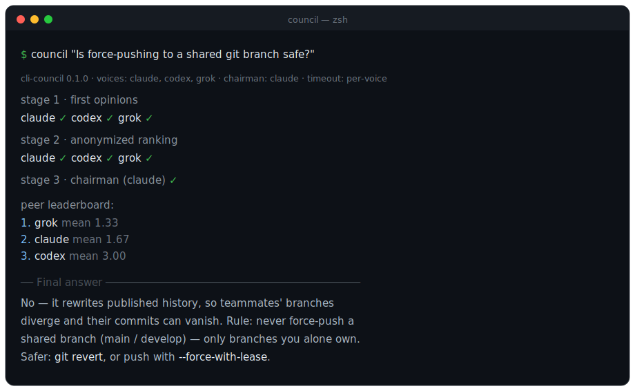
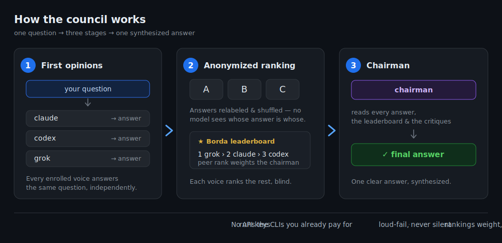
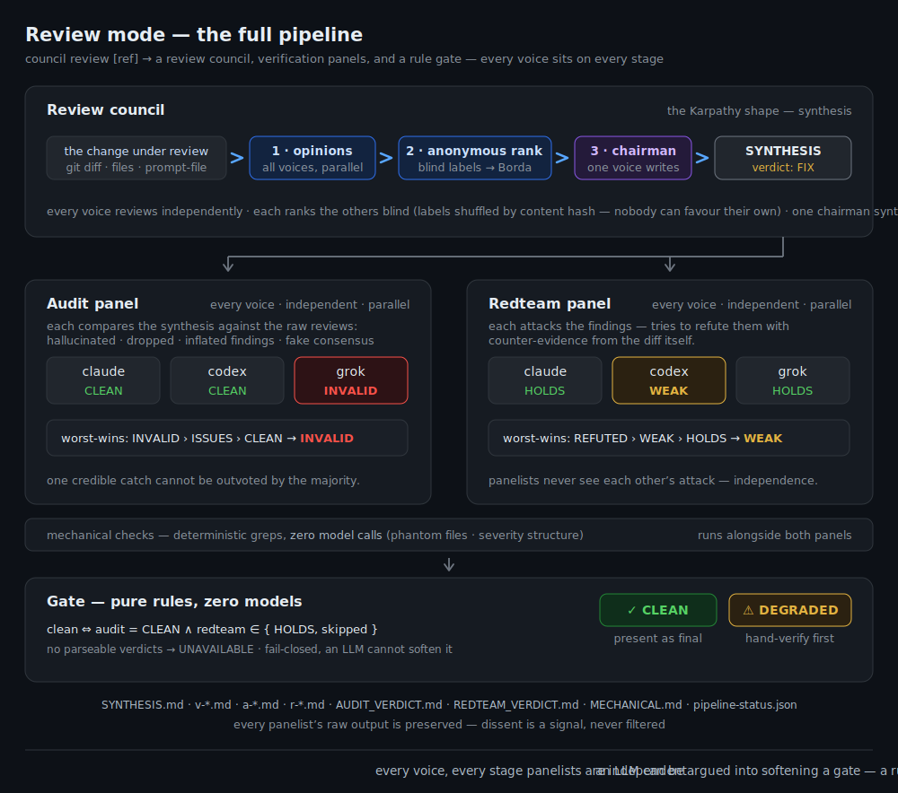
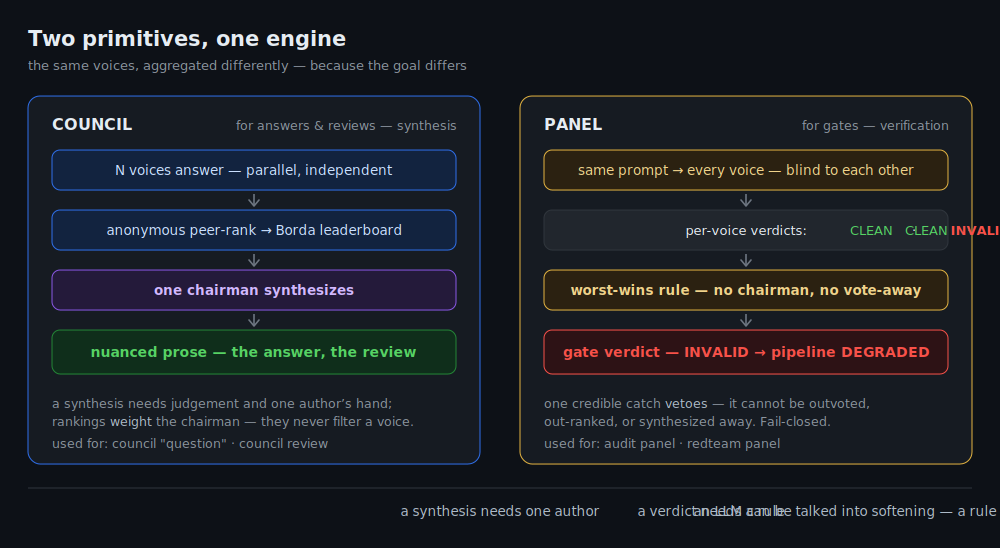

# cli-council

[](LICENSE)


Ask one question. Several models answer, **anonymously rank each other**, and a
chairman writes the final answer — using the **official CLIs you already pay
for**, not a paid API.

Inspired by [karpathy/llm-council](https://github.com/karpathy/llm-council),
rebuilt from scratch on a different substrate: **subscriptions, not API keys.**

<p align="center">
  
</p>

## Why it's different

- **No API keys by default.** Out of the box, cli-council sends zero HTTP
  requests to any model provider and stores zero credentials. It shells out to
  the official first-party CLIs — `claude`, `codex`, `grok`, `gemini` — that you
  installed and logged into yourself. Your subscription, your machine, your auth.
  _(You **can** add a token-based API voice if you want one — strictly opt-in,
  configured only in your own git-ignored `council.toml`, key kept in an env var.
  See [Token voices](#token-voices-optional). The default path never needs it.)_
- **Zero runtime dependencies.** Pure Python standard library + `subprocess`
  (plus stdlib `urllib` for the optional token path). Nothing to `pip install`,
  no SDK.
- **Native by default.** Out of the box the council is just **Claude** (via
  Claude Code, which is built for exactly this headless use). Every other voice
  is **opt-in** — add as many as you have subscriptions for.

Provider voices:

| voice  | CLI                    | status                              |
| ------ | ---------------------- | ----------------------------------- |
| claude | Claude Code            | native default                      |
| codex  | OpenAI Codex CLI       | supported                           |
| grok   | xAI Grok CLI           | supported                           |
| gemini | Google Gemini CLI      | experimental (headless auth varies) |
| agy    | Google Antigravity CLI | experimental (newer Google CLI)     |

For a **Google voice**, pick whichever CLI you actually run: the classic
`gemini` CLI, or Google's newer **Antigravity** (`agy`). On setups where the
gemini CLI has been retired, `agy` is the live Google voice. Both are gated by
their own smoke — enrol whichever PASSes on your machine.

- **A strict install contract.** The installer is an agent-driven, gated
  sequence: it detects which CLIs you have, offers to install the ones you want
  (with each vendor's own installer), walks you through each official login, and
  **smoke-tests every voice before enrolling it** — a voice that fails its smoke
  is refused loudly, never silently half-added. See
  [installer/CONTRACT.md](installer/CONTRACT.md).

## How it uses your subscriptions (read this)

cli-council is an **orchestrator of official tools**, not a bypass. It runs the
same `claude` / `codex` / `grok` / `gemini` commands you would run by hand,
one after another, and reads their stdout. That means:

- It spends your normal subscription usage. A council of N voices makes ~2N+1
  model calls per question (opinions + rankings + one chairman), so it consumes
  quota faster than a single chat. The installer shows you the cost before you
  enrol a voice.
- It respects each CLI's own auth and rate limits — it cannot and does not
  circumvent them.
- It is for **your own** use of **your own** authenticated CLIs. Do not use it
  to pool one subscription across multiple people; that is account sharing and
  violates the vendors' terms. cli-council ships no mechanism for it.

## How it works

<p align="center">
  
</p>

Three stages, mirroring the council idea:

1. **First opinions** — your question goes to every enrolled voice; answers are
   collected.
2. **Anonymized peer ranking** — each voice sees the others' answers relabeled
   `Response A / B / …` (the label→voice map never enters a prompt, so no model
   can favour its own house), and returns a strict `FINAL RANKING:` block. A
   Borda count turns the rankings into a leaderboard, and each voice's written
   critique is kept as second-order context.
3. **Chairman** — one designated voice (default: your native Claude) reads all
   answers, the leaderboard, and the critiques, and writes the final answer.

A voice that errors or fails to produce a parseable ranking is reported
**loudly** and dropped from that stage — never silently swallowed.

## Install

Requires Python 3.11+ (stdlib only — nothing to `pip install`).

```bash
git clone https://github.com/LARIkoz/cli-council && cd cli-council
./install.sh          # runs the strict install contract (detect → choose → install → login → smoke)
```

The installer is designed to be driven by an agent (e.g. Claude Code) so it can
run the vendor installers and hand you each login link. You can also run the
deterministic parts by hand — see [installer/CONTRACT.md](installer/CONTRACT.md).

## Run

`council` lives in `bin/` — put it on your PATH, or call `./bin/council` from the
repo (both set Python's path for you):

```bash
council "your question here"
council --chairman codex "your question"     # pick who synthesises
council --voices claude,grok "your question" # ad-hoc subset of enrolled voices
```

## Review mode

The same council, pointed at a code change instead of a question. Voices review,
anonymously peer-rank each other's **reviews**, and a chairman synthesises one
review with a verdict (`SHIP` / `SHIP-WITH-EDITS` / `FIX` / `REWORK`) and findings
grouped by severity (`BLOCKER` / `IMPORTANT` / `CHECK` / `ACCEPT` / `NOISE`) —
then, optionally, **verification panels** check the synthesis itself and a rule
gate decides whether the pipeline is clean.

<p align="center">
  
</p>

```bash
council review                       # review uncommitted changes (git diff HEAD)
council review main                  # review the working tree against a ref
council review --files a.py b.py     # review whole files instead of a diff
council review --prompt-file r.md    # use a prepared review prompt verbatim
council review --out ./out HEAD      # also write the full artifact set (see below)
council review --audit codex,grok --redteam grok HEAD   # ad-hoc panels
council review --no-verify HEAD      # bare council review, skip configured panels
```

`review` is a subcommand, so `council "…"` (ask) is unchanged. The big review
prompt reaches each voice through its normal transport — `claude`/`codex` on
stdin, `grok` via its prompt file, a token voice in the request body — so a large
diff isn't an argument-length problem.

### Verification panels — every voice checks, a rule decides

A synthesis can hallucinate a finding, drop one, or invent consensus. So after
the council, two **panels** verify it — and a panel is deliberately _not_ another
council:

- **Audit panel** — every audit voice independently compares the synthesis
  against the raw reviews (hallucinated / dropped / inflated findings, fake
  consensus). Verdicts: `CLEAN` / `ISSUES` / `INVALID`.
- **Redteam panel** — every redteam voice independently attacks the findings,
  trying to refute them with counter-evidence. Verdicts: `HOLDS` / `WEAK` /
  `REFUTED`.
- **Mechanical checks** — deterministic greps (phantom files, severity
  structure), zero model calls.

Panelists never see each other's output, and the panel verdict is aggregated by
a **worst-wins rule**, not by a chairman: any single `INVALID` makes the audit
`INVALID`; any `REFUTED` makes the redteam `REFUTED`. One credible catch cannot
be outvoted, out-ranked, or synthesized away — and a rule, unlike an LLM, cannot
be talked into softening. The **gate** is then pure rules: the pipeline is
`clean` only when audit is `CLEAN` and redteam `HOLDS` (or wasn't run); anything
else is `degraded` with reasons listed; no panels configured = `unverified`.

<p align="center">
  
</p>

With `--out`, the full evidence set is persisted — every panelist's raw output
included, so a lone dissent stays visible: `SYNTHESIS.md`, `v-<voice>.md`
(reviews), `a-<voice>.md` / `r-<voice>.md` (panelists), `AUDIT_VERDICT.md`,
`REDTEAM_VERDICT.md`, `MECHANICAL.md`, `RANKINGS.md`, machine-readable
`pipeline-status.json`, and a `PIPELINE_DEGRADED.md` marker when not clean.

## Decide mode

The same council + verification, pointed at a **decision** instead of a code
change. Voices recommend, anonymously peer-rank each other's recommendations, and
a chairman synthesises one recommendation with the trade-offs and next actions
grouped by tier (`BLOCKER` / `IMPORTANT` / `CHECK` / `ACCEPT` / `NOISE`) — then an
**audit panel** checks the synthesis is faithful to the raw voices and a rule gate
decides whether it's clean.

```bash
council decide "Postgres or MySQL for a write-heavy analytics workload?"
council decide --out ./out "should we self-host the model or use an API?"
council decide --voices opus,codex,agy,qwen "…"   # add an opt-in token house
council decide --no-verify "…"                    # bare recommendation, no audit
```

Two things differ from review, both because a decision has no ground truth:

- **Audit, not redteam, is the guard.** A redteam _refutes a claim_ — right for a
  bug (true or false), but a recommendation has nothing to refute. So redteam is
  **off by default**; the load-bearing check is the **audit** — that the synthesis
  didn't invent convergence, misattribute a voice, or inflate an action tier. The
  audit verdict (`CLEAN` / `ISSUES` / `INVALID`) and the same worst-wins gate carry
  over unchanged. (Turn redteam on per run with `--redteam …` to pressure-test a
  recommendation.)
- **Family quorum.** A decision must draw on **≥3 model families** before it will
  synthesise — two voices of one house (e.g. `opus` + `sonnet` = Anthropic) count
  once, so no single vendor's models decide alone. Below quorum, the run aborts
  loudly _before_ synthesis rather than presenting a monoculture recommendation.

`--out` writes the same artifact set (`SYNTHESIS.md`, `AUDIT_VERDICT.md`,
`RANKINGS.md`, per-voice `v-`/`a-`/`r-` files, `pipeline-status.json`).

## Claude Code commands (optional)

If you drive this from an agent like [Claude Code](https://claude.ai/code),
[commands/](commands/) holds two ready-made slash-commands over the engine — copy
them into `~/.claude/commands/`:

- **[commands/consilium.md](commands/consilium.md)** — `/consilium <decision>` →
  `council decide` (recommendation + action tiers + a mandatory audit gate).
- **[commands/consreview.md](commands/consreview.md)** — `/consreview [ref]` →
  `council review` (severity-classified review + audit & redteam gate).

Each calls `council` on your PATH, auto-discovers `council.toml`, reads the artifact
set, and follows the re-synth protocol when a gate flags the synthesis.

## Configure

Enrolment lives in `council.toml` (git-ignored, written by `doctor enroll`; see
[council.example.toml](council.example.toml)):

- **`voices`** — the enrolled voices. Only smoke-PASSED ones belong here, and
  `doctor enroll` re-smokes to keep it that way.
- **`chairman`** — who writes the final answer (default: `claude`).
- **`timeout`** — leave it out to use the **per-voice defaults**: fast native
  voices ~300s, slower reasoning voices (`codex`, `grok`) 600s, because the
  peer-ranking prompt carries every other answer and takes longer. Set it to
  force one ceiling on every voice, or override a single voice under
  `[providers.<name>]`.
- **`[review]`** — default verification panels for `council review`
  (`--audit`/`--redteam` override them per run, `--no-verify` skips both):

  ```toml
  [review]
  audit   = ["claude", "codex", "grok"]   # panel: synthesis vs raw reviews
  redteam = ["codex", "grok"]             # panel: adversarial attack on findings
  ```

- **`[decide]`** — the same, for `council decide`. Audit is the mandatory guard;
  redteam is off by default (a recommendation has no claim to refute):

  ```toml
  [decide]
  audit   = ["claude", "codex", "grok"]   # panel: synthesis vs raw recommendations
  redteam = []                            # off by default; add voices to pressure-test
  ```

- **`family`** — a voice's vendor lineage (`family = "anthropic"`), used only by
  the `council decide` family quorum so two voices of one house count once. The
  built-ins carry theirs; set it on any voice you define. Optional for ask/review.

### Extra CLI voices — two models of one CLI (optional)

A `[providers.<name>]` block with `type = "cli"` **defines a new CLI voice** from
scratch — most useful for enrolling **two models of the same CLI** as separate
voices, which the single built-in entry can't express. For example, one Claude
voice on Opus and another on Sonnet:

```toml
[providers.opus]
type = "cli"
bin  = "claude"
argv = ["claude", "-p", "--model", "opus"]
native = true

[providers.sonnet]
type = "cli"
bin  = "claude"
argv = ["claude", "-p", "--model", "sonnet"]
native = true

[council]
voices   = ["opus", "sonnet", "codex", "grok"]
chairman = "opus"
```

`argv` is the exact command **as an array** — a bare string is rejected at load
(it would explode into per-character arguments). The prompt reaches the CLI by the
same convention as the built-ins: a `{prompt_file}` slot, a `{prompt}` slot, or,
with neither, on stdin. A block whose name matches an **existing** voice overrides
it (`argv` / `bin` / `timeout`) instead of defining a new one.

### Token voices (optional)

The default council is subscription-CLI only and needs no keys. If you'd rather
add a voice you _don't_ have a CLI for, you can point cli-council at any
**OpenAI-compatible** `/chat/completions` API by declaring a `type = "http"`
provider in your `council.toml`:

```toml
[providers.deepseek]
type     = "http"
endpoint = "https://api.deepseek.com/v1/chat/completions"
model    = "deepseek-chat"
key_env  = "DEEPSEEK_API_KEY"   # cli-council reads the key from THIS env var — never from the file

[council]
voices   = ["claude", "codex", "deepseek"]
chairman = "claude"
```

The API key is read from the named environment variable **at call time** — it is
never written to `council.toml`, never logged, and never stored. The transport is
still stdlib-only (`urllib`), so there's nothing new to install. Verify a token
voice before enrolling it, exactly like a CLI voice: `doctor smoke deepseek`
(PASS = key present **and** the endpoint answers). DeepSeek, Mistral, Groq,
SiliconFlow, NVIDIA NIM, and DashScope's OpenAI-compatible mode all speak this
shape; see [council.example.toml](council.example.toml) for more examples.

## Status

Early, but the full three-stage council runs end-to-end today. Verified live:
`claude`, `codex`, `grok`, and Google's `agy`. The strict install contract is
real, not aspirational — `doctor enroll` re-smokes each voice and writes only the
ones that answer; in testing it refused a retired-tier `gemini` and a
misconfigured `codex` **loudly** rather than half-adding them, and a voice that
dies mid-council is likewise dropped while the rest carry on. `gemini` is
structurally supported, but some Google tiers are retired in favour of `agy`, so
like everything else it's gated by its own smoke. The optional token (`http`)
transport is verified live too — a `type = "http"` voice made a real
OpenAI-compatible call and its answer flowed through ranking and synthesis like
any CLI voice. The review pipeline is exercised by a smoke matrix through the
real CLI (clean / worst-wins dissent / refuted / dead panelists / all-dead
fail-closed / loud failures) plus a live end-to-end run — council, both panels,
gate, artifacts. Contributions welcome.

## License

MIT — see [LICENSE](LICENSE). Not affiliated with Anthropic, OpenAI, xAI, or
Google; "Claude", "Codex", "Grok", "Gemini", and "Antigravity" are their owners'
marks, used only to name the CLIs this tool invokes.
