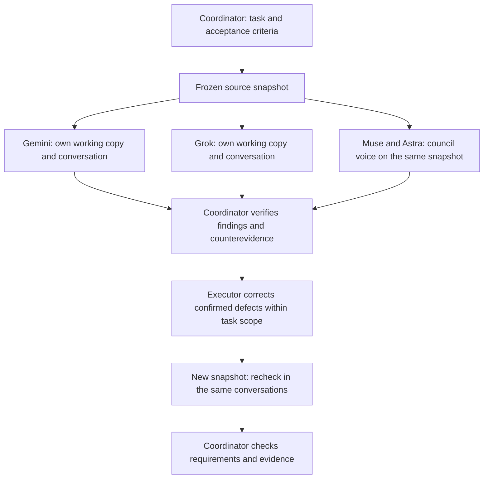

# Continued code-review sessions

Status: supervised native-session workflow, previously live exercised on
2026-09-07. P1A now closes this backend's live launch/resume/recheck admission
until a qualified whole-turn containment boundary exists. Preparation,
preflight, status, recovery and explicit finite local fixtures remain available;
best-effort lineage observation is not native admission.
Python 3.11+;
Antigravity 1.1.27; Grok CLI 1.0.13 stable. Existing subscription sign-in is
required. The controller does not log in, buy credits, use API-key fallbacks,
or silently replace a model.

## Purpose and responsibility

Use this mode when reviewers must investigate the repository and continue
their investigation after a coordinator asks for counterevidence or a recheck.
The main assistant owns task acceptance; external agents supply reports and
execution evidence. The `council review` batch and `council decide` pipelines
are separate and keep their existing engine behavior.



A native process may exit between turns. Its saved conversation ID provides
continuity. P1A's guardian retains the reviewer lease while it stops process
instances that it actually observed, but setsid/double-fork observation races
and identity-check/signal TOCTOU remain unqualified. The default native gate is
therefore closed; tmux does not provide the missing containment boundary.

## Input and launch

Write an English task file containing the original goal, numbered requirements,
acceptance criteria, relevant constraints and known checks/results. Missing
verification stays explicit. The source must be a Git repository. Choose a
new durable output directory **outside** the reviewed repository.

Commands assume `council` from this checkout is on PATH (or use its `bin/council`).
Place persistent repositories and runs under the workspace root.

```bash
council review-session start \
  --repo /path/to/repository \
  --task-file /path/to/task.md \
  --out /path/to/review-runs/change-001 \
  --gemini-model '<the newest label from `agy models`>' \
  --grok-model '<the newest model from `grok models`>' \
  --prepare-only

council review-session preflight /path/to/review-runs/change-001
council review-session status /path/to/review-runs/change-001
```

Preparation is local. Preflight saves actual binary identity, version, help
and exact model-catalog membership; it is not model-quality admission.
The live `run`, `ask`, `recheck` dispatch and native resume paths currently fail
closed before process launch. Omitting `--prepare-only` does not bypass this gate.
A changed binary or model selection requires preflight again. There is no
automatic fallback and no family quorum inferred from provider names.

## Coordinator loop

This describes the intended loop after native admission is qualified. While the
gate is closed, steps 3 and 5 are unavailable: keep their proposed prompts as
local evidence, and use only preparation, preflight, status or recovery.

1. Read each initial response and its raw tool evidence independently. Preserve
   original findings even if the other reviewer did not find them.
2. For each material candidate, check the triggering input, relevant source,
   requirement and concrete behavior. Agreement and reviewer ranking are not
   proof. Record confirmed, refuted or unresolved with the reason.
3. Send targeted counterevidence to the original reviewer using `ask`. Keep
   stable finding IDs, and distinguish independent discovery from later support.
4. The executor may fix confirmed defects within the existing task scope.
   This controller does not dispatch automatic repairs. Product compromises
   and changed requirements still belong to the task owner.
5. Use `recheck` for changed source. Require the original failing scenario,
   applicable regressions, the new snapshot ID and each prior finding's state.
   Omission of a finding does not close it. Review all task criteria before
   independently declaring acceptance.

```bash
# Interface examples for a future qualified backend. They fail closed now and
# do not launch or mutate a selected generation.
council review-session ask /path/to/review-runs/change-001 \
  --reviewer grok --prompt-file /path/to/counterevidence.md --timeout 180

council review-session recheck /path/to/review-runs/change-001 \
  --repo /path/to/repository \
  --prompt-file /path/to/recheck-request.md --timeout 180

council review-session status /path/to/review-runs/change-001
council review-session recover /path/to/review-runs/change-001
council review-session cancel /path/to/review-runs/change-001 --reviewer=gemini
```

`ask` uses the existing frozen snapshot. When native admission is later
qualified, `recheck` will freeze the current bytes from the original repository,
preserve old snapshots and working copies, and resume the exact saved native IDs.
It stages and verifies both reviewer generations before activation. A failure
leaves a durable pending transition; `recover` restores the preserved prior
generation without launching a reviewer. Changed task criteria or a different
repository require a new session. A successful report for the selected
snapshot says nothing about later edits to the original checkout.

The CLI default deadline is 180 seconds per turn, with a hard maximum of 3600.
Set an explicit budget for a repository acceptance review: the real-task pilot
took about 396 seconds for Gemini and exceeded 600 seconds for Grok's first
investigation. The 900-second initial example allows more investigation; it
does not guarantee completion. Short targeted follow-ups can use 180 seconds.
Prompts reserve the final 20% for reporting unfinished checks and findings.
Only one active turn per reviewer is allowed. In explicit finite local fixtures,
the guardian continuously observes lineage, stops exact boot/PID/start-bound
instances, and publishes a nonce-bound cleanup receipt before releasing the
lease. This passes the named local success/cancel/timeout/coordinator-death
fixtures but does not prove that every descendant was observed. Live admission
stays closed. Recheck acquires all reviewer leases before changing any files.

If stopping a process group fails, `cleanup_failed` retains the original failure,
native ID and partial evidence in `result.json`; workspace integrity is unverified.
Before a follow-up or recheck can proceed, the controller requires a durable,
nonce-bound guardian receipt plus current-boot exact-instance absence. Numeric
PID/PGID absence, an old boot, a reused identity or incomplete evidence blocks
execution and workspace replacement. Confirmed exact cleanup creates a separate `cleanup-resolution.json`;
the old failed turn remains failed. This is process cleanup, not recovery of a
missing native conversation ID.
The same check uses `active_turn/process.json` or the per-turn result when
`reviewer.json` still says running because its final write was interrupted.

For a new Grok conversation, the controller saves a planned UUID before launch
and passes `--session-id UUID`. A planned ID is not proof that a session exists.
If the native turn ends before emitting its ID, recovery reads only that UUID's
native state for the exact workspace. The currently qualified adapter requires
`summary.json` scope identity, `chat_format_version: 1`, and exact structured
`prompt_index: 0` user-query content matching the saved prompt hash (Grok 1.0.13).
Missing, mismatched, malformed or oversized state remains unverified. There is
no global search, latest-session selection, export subprocess, or hidden fresh
conversation. A changed native persistence format requires new qualification.

`native-result.json` and a preliminary `result.json` are saved before recovery.
Successful handle recovery leaves the interrupted turn incomplete; `ask` then
continues the same ID. If the coordinator died before recovery finished, `ask`
can repeat the exact read after the previous process group is confirmed absent.
Recovery does not launch another inference automatically or accept the task.
Identity recovery alone does not prove that the native loader can resume every
part of an interrupted history; the subsequent native turn must still succeed.

## Reading results

- `session.json`, `task.md`,
  `snapshots/NNNN/{manifest.json,change.preview.txt,change.capture.jsonl,source/}`:
  task and source identity. The snapshot identity binds current file paths,
  bytes and executable bits, the immutable baseline commit/tree content, and
  the exact captured-change packet digest. The named JSONL format carries
  complete old/new bytes as base64 plus hashes, lengths and executable modes;
  it is explicitly not a unified patch. Reviewers read the captured-byte-derived
  text preview first and use the lossless JSONL for empty, binary,
  no-final-newline and mode-sensitive cases. Both files are identity-bound.
- `reviewers/<name>/reviewer.json`: requested model, exact conversation ID,
  historical `report_snapshot`, `installed_generation`, integrity state and
  latest transport status. Session status also exposes `transition_state`.
- `reviewers/<name>/preflight/<id>/`: version, help and model-list evidence.
- `reviewers/<name>/turns/NNNN/`: `prompt.txt`, `stdout.ndjson`, `stderr.log`,
  `events.ndjson`, `response.md`, `process.json` and `result.json`.
- `native-result.json` preserves the native attempt before identity recovery;
  `identity-recovery/<id>/` preserves separate binding evidence and its verdict.
- `reviewers/<name>/workspace/` and `archives/`: current and archived
  working copies. Inspect the actual saved directory names before linking.

`completed` / `report_received: true` means a nonempty answer arrived with a
recognized successful terminal event, matching native conversation ID and
zero process exit, with the reviewed source/input packet unchanged.
Timeout, cancellation, invalid protocol, changed source or missing terminal
result cannot become success from partial text. Output across stdout and
stderr is bounded to 32 MiB per turn. **`claims_verified: false` and
`task_accepted: false` remain false even after a successful recheck.**

Requested and runtime-reported model identities are retained separately.
Antigravity's `init.model` is a configuration echo, not backend attestation.
In this pilot Grok requested `grok-4.6`, while native terminal `modelUsage`
reported `grok-4.6-build`. Preserve that provenance instead of renaming it.
Raw provider streams can contain opaque signed usage payloads; keep them in
private run artifacts and summarize only needed metadata.

## Practical limits

- Separate copies provide version separation, **not an OS security sandbox**.
  The current headless adapters auto-approve tools. Global CLI customization
  and subscription state still exist. Use the prototype only in the authorized
  local context. This backend's live native gate is now closed; a qualified
  containment boundary and context restrictions remain future work.
- Antigravity can choose a parent project's default tool directory even when
  `init.cwd` is correct. The controller sets `cwd` and `PWD`, supplies absolute
  input paths and requires every shell command to start with `cd <workspace> &&`.
  Verify actual tool evidence; an instruction is not an enforced sandbox.
- Git discovery is capped at the source copy's parent and inherited Git
  worktree overrides are removed. The prompt states that native Git history is
  absent. Use the supplied manifest/diff; unrelated parent Git output cannot
  establish the reviewed source or its integrity. This is a Git guard, not a
  general filesystem access boundary.
- Snapshots include tracked and nonignored untracked source, including staged,
  dirty and deleted paths. Baseline reads are pinned to the immutable commit OID
  resolved at capture start; current bytes are copied and reverified while the
  checkout/index receipt remains stable, and the diff is derived only from those
  captured bytes. Observed HEAD, index or source motion rejects publication; the
  prototype does not lock out an external adversarial ABA writer. Git history
  and ignored dependencies/build outputs are omitted.
  Symlinks and submodules are rejected. Limits are
  10,000 files and 64 MiB; there is no automatic dependency installation.
- Reviewers must not edit source or the input packet. Source changes, added
  files, executable caches/build outputs and changed task evidence invalidate
  receipt. Per-turn Python/XDG/temp cache roots are moved outside the source
  workspace, but actual imported/build bytes remain unqualified telemetry. This
  catches persisted post-turn changes, not arbitrary transient writes or access
  outside the copy.
- Grok's stream normally reports identity at its terminal event. New turns
  now reserve an ID, and exact native-state recovery can establish it earlier
  after an interruption. If persistence never happened, continuation remains
  unavailable. Older sessions without a reservation still require manual,
  evidence-bound recovery. Mid-turn steering uses cancel, then an explicit turn.
- Findings and acceptance remain coordinator-managed prose. There is no
  automatic adjudication schema, repair dispatch, dashboard, or production gate.

## Evidence and next evaluation

The synthetic pilot preserved two snapshot hashes and both conversations.
Both models found the paging off-by-one error, answered a concrete
counterargument, and rechecked an executor fix with five passing tests.
Six turns completed; one earlier Antigravity turn was cancelled for using the
wrong tool directory. A conversation-only marker was recalled on follow-ups.
This demonstrates continuation and evidence capture, not a gain in review
quality from mixed model families.

The follow-on controlled pilot used a frozen protocol, a hidden executable
oracle, raw native turns and separate post-fix diagnostics. Do not convert this
small synthetic pilot into a general model ranking. Foreign-context runs and
diagnostic retries must remain visible; measure targeted dialogue separately.

That pilot received 14 of 16 planned initial reports: one Grok turn timed out
and the remaining lane slot was skipped after a cleanup error. The final adapter
automatically recovered that exact conversation, obtained its report, and passed
a tool-free marker-recall turn without changing the initial failure evidence.
All completed defect-case reports found the same two seeded root causes; no
additional mixed-family root cause was established. Parent Git diffs reached
some reviewers, so the comparison is diagnostic only. The Git guard, recovery
binding and result persistence fixes passed 56 local tests and an independent
fault recheck.

Protocol sources: [Antigravity headless](https://antigravity.google/docs/cli/headless/)
and [Grok headless](https://docs.x.ai/build/cli/headless-scripting).

## Real-task findings — 2026-09-07

A real product task exercised this route on an explicit 401-file source projection.
Its original product branch/SHA, file hashes and task diff were recorded separately
from the bundle's own Git HEAD and controller snapshot ID. A clean bundle's empty
captured-change record set is not evidence that the product task made
no changes. When a full
repo exceeds prototype limits, disclose omissions and retain a way to request
missing context; never silently truncate it or label the projection a full clone.

The initial reports were not acceptance-quality conclusions. One reviewer used
an invalid-checksum fixture and understated a lost-response defect; targeted
valid frames exposed a false-green verdict. Other candidates remained hypotheses
or product-semantics questions. Verify frame length/checksum, reply permutations,
actual caller behavior and exact source lines before counting a finding. Preserve
coordinator errors and corrections too. One run does not establish mixed-family superiority.

The Grok initial turn hit 600 seconds. Native tools had executed, but there was
no terminal report or native ID in the stream. Manual recovery matched the exact
workspace AND complete original prompt in Grok's read-only native session index,
then verified the exact-ID native export before resuming. This is a documented
manual recovery, not a guessed latest session. Keep the interrupted turn
incomplete. The separate follow-on qualification established preallocated
native UUID continuation; the automatic adapter described above uses exact
structured native history instead of Markdown export prefix matching.

The timeout also exposed local `killpg` returning `EPERM` after the owned process
group had disappeared. The controller now checks process-group absence before
treating that error as already stopped; a still-present/unknown group remains an
error. It also gives reviewers an explicit reporting deadline at 80% of the hard
turn limit. Session runtime tests cover the absence/presence/inventory-failure
distinction.

## Roster

This controller runs two reviewers, Gemini and Grok. If your setup requires more
voices on every review (for example a fixed roster in your own agent
instructions), run the others alongside it on the same frozen snapshot through
`council voice <name>` and record their reports in the same ledger. Give the two
native reviewers the newest model at top effort, not the example labels of the
launch command above. Check that no voice is missing; never replace a missing
voice with another model. While native admission is closed, run the review
through the batch engine (`council review`) with your enrolled roster.
